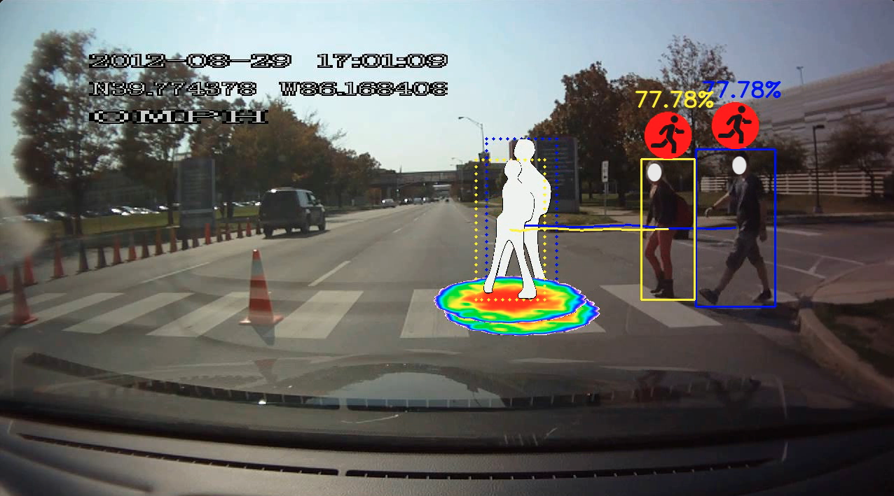
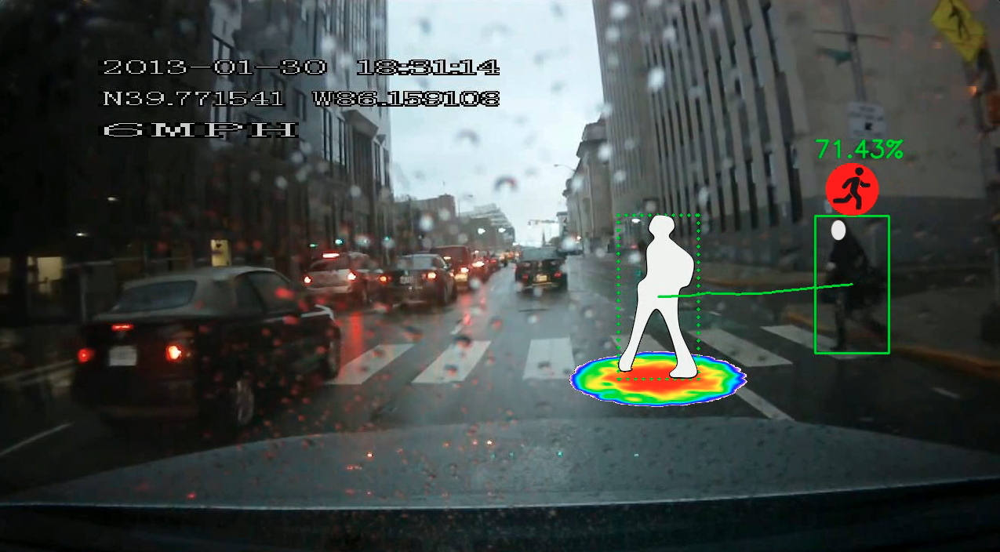

# This folder contains the baseline of pedestrian trajectory prediction based on  PSI dataset.




([**PSI2.0**](https://github.com/PSI-Intention2022/PSI-Dataset) is an extension dataset based on the [**PSI1.0**](http://situated-intent.net/) dataset.)

### :bookmark: News :
- 20230606: The official [[Homepage](https://psi-intention2022.github.io)], [[GitHub](https://github.com/PSI-Intention2022/PSI-Competition)], and [[CodaLab]() ([Track 1](https://codalab.lisn.upsaclay.fr/competitions/13808#phases))([Track 2](https://codalab.lisn.upsaclay.fr/competitions/13812?secret_key=7a566b48-693d-47cf-9de8-d43e6b6fa512#phases))([Track 3](https://codalab.lisn.upsaclay.fr/competitions/13818?secret_key=bc6903e6-0a62-4df2-bb14-b31ae7b40a63#participate))] of the IEEE ITSS Student Competition are public. 

---

## 1. PSI dataset Structure
Please refer to [PSI dataset](https://github.com/PSI-Intention2022/PSI-Dataset) for the details of PSI dataset and data structure.

## 2. Trajectory Prediction Baseline
(0) Arguments

```buildoutcfg
# Experimental Setting
Input: Observed video sequence + target pedestrian bounding box sequence
Output: Future trajectory prediction (bounding boxes sequence)
Observed sequence length: 15 frames (0.5s for 30 fps)
Predicted sequence length: 45 frames (1.5s for 30 fps)
Overlap rate: 0.9 for traingin/validation, 1 for test 
              (To sample tracks with stride length = len(observed_sequence_length) * overlap rate
Video Splits: 
    ('./splits/PSI200_split.json')
        - Train: Video_0001 ~ Video_0110
        - Val: Video_0111 ~ Video_0146
        - Test: Video_0147 ~ Video_0204
    ('./splits/PSI100_split.json')
        - Train: Video_0001 ~ Video_0082
        - Val: Video_0083 ~ Video_0088
        - Test: Video_0089 ~ Video_0110
```

(1) Generate database
```buildoutcfg
./database/create_database(args)
```
Organize the data into format as:
```python

db = {
    - *video_name*: { # video name
        - *pedestrian_id*: { # target pedestrian name
            - 'frames': [0, 1, 2, ...], # list of frames that the target pedestrian appear
            - 'cv_annotations': {
                - 'track_id': *track_id*, # target pedestrian's track_id, obtained from raw annoation
                - 'bbox': [[xtl, ytl, xbr, ybr], [], [], ...], # list of bounding boxes of the target pedestrian appeared
            },
            - 'nlp_annotations': {
                - *annotator_id*: { # annotator's id/name
                    - 'intent': [], # list of crossing itnent at speific frame, extended from key-frame annotations 
                    - 'description': [], # list of explanation of the intent estimation for every frame from the current annotator_id
                    - 'key_frame': [] # if the specific frame is key-frame, directly annotated by the annotator. 0-NOT key-frame, 1-key-frame
                },
                ...
            }
        }
    }
}
```
**Pedestrian trajectory ground-truth:**

The ground-truth trajectory is the sequence of positions (bounding boxes) of the target pedestrian in the future time steps.

(2) training / validation / test split

Our splits are provided in ```./splits```. Specifically, for PSI100, all videos are splited into train/val/test as ratio 
$0.75:0.05:0.2$. For PSI200, we take the first 110 videos (same as all PSI100 data) as training set, video_0111 ~ video_0146
as validation, and the rest 50 videos are for test. 


(3) Run training
```shell
python main.py
```

(4) Evaluation Metrics
```buildoutcfg
ADE: Average Displacement Error
FDE: Final Displacement Error
ARB: 
FRB: 
```
|Dataset|split|ADE|FDE|ARB|FRB|
|:---|:---|:---|:---|:---|:---|
|PSI 2.0|val||||
|PSI 2.0|test||||
|PSI 1.0|val||||
|PSI 1.0|test||||


(4). Environment
```buildoutcfg
Python 3.8
PyTorch 1.10.0 + Cuda 111
Tensorboard 2.10.1
```

(5) Notes

This baseline only take the bounding boxes sequence of the target pedestrian as input. However, PSI contains various
multi-modal annotations and information available for further exploration to contribute to the intent prediction. E.g.,
Video sequence, other road users bounding boxes, detailed text-based explanation annotations, etc.


### References 

[1] Tina Chen, Taotao Jing, Renran Tian, Yaobin Chen, Joshua Domeyer, Heishiro Toyoda, Rini Sherony, Zhengming Ding. "Psi: A pedestrian behavior dataset for socially intelligent autonomous car." arXiv preprint arXiv:2112.02604 (2021). 

[2] Chen, Tina, Renran Tian, and Zhengming Ding. "Visual reasoning using graph convolutional networks for predicting pedestrian crossing intention." In Proceedings of the IEEE/CVF International Conference on Computer Vision, pp. 3103-3109. 2021. 


### Contact 

Please feel free to send any questions or comments to [psi.intent.benchmark@gmail.com](psi.intent.benchmark@gmail.com)

